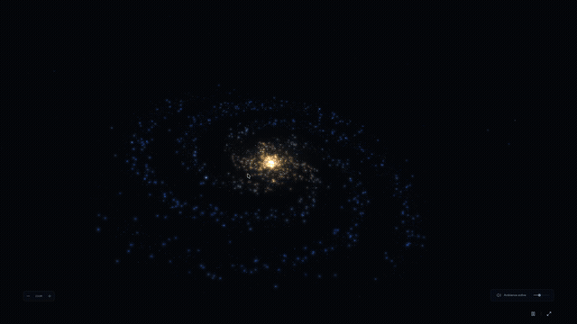

# ASTRA — Observatoire interactif

Une galaxie 3D interactive en français : chaque particule représente un astre indépendant, sélectionnable et généré procéduralement à l’approche. Three.js assure le rendu, React l’interface, et TypeScript la structure du code.

Démo en ligne : [astra-explorer.guillaumegirard.fr](https://astra-explorer.guillaumegirard.fr)



## Démarrer

```sh
npm install
npm run dev
```

Ouvrir http://localhost:3000. Node 22 est installé localement pour les scripts npm. Pour un nouvel environnement, utiliser Node 22.13 ou supérieur.

```sh
npm run build       # compilation de production
npm run lint        # qualité du code
npx tsc --noEmit    # types
npm test           # identités, mouvement, LOD et ressources
```

## Publication sur OVH

`npm run build:static` produit le site autonome dans `out/`. Transférer le contenu
de ce dossier par FTP dans la racine dédiée à ASTRA. La pipeline GitHub automatise
ce transfert à chaque push sur `main`, après configuration des secrets OVH.
`npm run preview:static`
permet une vérification locale. Voir [les étapes de déploiement](DEPLOYMENT.md).

## Explorer chaque astre

- **Clic / toucher sur une particule** : sélectionner cet astre ; un repère et sa fiche indiquent son identifiant et son type.
- **Double-clic**, **Entrée** sur le canvas ou **Explorer cet astre** : approcher sa surface.
- **Molette, pincement, boutons +/−** : zoom continu sur l’objet sélectionné. Sans sélection, la molette choisit d’abord la particule sous le pointeur ; les boutons choisissent celle au centre de l’écran, ou le premier identifiant si aucun point n’est visé.
- **Glisser dans la scène** : tourner autour de l’objet. La caméra suit son mouvement.
- **Flèches gauche/droite** sur le canvas ou boutons précédent/suivant : parcourir les identifiants actifs. Cela permet également d’atteindre une particule masquée par une autre.
- **Retour à la galaxie** ou **Début** : quitter le suivi et revenir à la vue d’ensemble.
- Curseurs : densité (10 000 à 120 000 astres) et vitesse de rotation. Une réduction de densité retire les identifiants dépassant la limite et quitte leur suivi si nécessaire.
- Pause : suspend la rotation. Mode immersif : masque l’interface principale ; Échap la restaure. L’interface s’efface aussi d’elle-même après 10 secondes d’inactivité, pour une vue plus contemplative, et revient dès qu’une activité reprend.

Sur ordinateur et mobile, la barre basse regroupe découverte/retour, zoom, pause, son et le menu **⋯**. Le zoom, le son et la pause utilisent uniquement des icônes avec noms accessibles et infobulles. **⋯ → Avancé** contient le nombre d’astres, la vitesse et la couleur ; **⋯ → Volume** contient le niveau sonore. Langue, aide et crédits sont également dans ce menu. La sélection affiche un résumé compact : **Détails** ouvre les informations, **Explorer autour** regroupe la navigation et **Angle de vue** apparaît à proximité. Une seule surface est ouverte à la fois ; elle ne disparaît pas pendant la lecture. Rétablir les réglages conserve le cadrage (sauf si la nouvelle population retire l’astre suivi). Les points du halo distant appartiennent au même catalogue sélectionnable ; la poussière et le halo lumineux central sont des effets de lumière.

## Identités et génération procédurale

Un identifiant de particule produit une graine déterministe. Revenir sur `AST-000006`, modifier la densité ou libérer son maillage ne change pas sa nature ni sa surface. Les douze familles sont :

- **Naines rouges, étoiles géantes, étoiles bleues et naines blanches** : plasma animé, couleurs et plages de taille distinctes.
- **Planètes telluriques, mondes océaniques, déserts, mondes volcaniques et planètes glacées** : continents, nuages, dunes, fissures de lave ou fractures de glace selon leur nature.
- **Géantes gazeuses** : bandes atmosphériques, parfois des anneaux.
- **Satellites rocheux et astéroïdes** : surface minérale, cratères stylisés et formes allongées pour les astéroïdes.

Les rayons sont tirés sur une échelle logarithmique propre à chaque famille, puis réduits : étoiles ÷40, planètes et petits corps ÷160 par rapport à la version précédente. La fiche indique le système et le rôle du corps ; il ne s’agit pas de kilomètres réels. Les mêmes identifiants reproduisent les mêmes propriétés dans cette version du générateur.

Les détails utilisent du bruit 3D calculé dans un shader, sans texture téléchargée. Il s’agit d’un univers artistique : les distances sont choisies pour l’exploration, sans simulation gravitationnelle N-corps. Chaque groupe de huit identifiants forme un système : une étoile centrale, cinq planètes, un satellite lié à la cinquième planète et un astéroïde externe. Les rayons orbitaux vont de 0,025 à environ 0,72 unité ; la lune est à environ 0,0032 unité de sa planète. Les orbites sont calculées relativement à un parent, puis additionnées à celles de ses ancêtres. Le mouvement galactique reste appliqué au centre commun du système. La fiche affiche le système parent. Les flèches permettent de parcourir ses membres puis le système suivant. Les halos des compagnons sont atténués pour éviter leur accumulation à distance.

## Organisation du code

`app/page.tsx` contient l’interface et la fiche de sélection. Une référence React transmet les commandes au moteur sans rendre à nouveau toute l’interface à chaque image.

`lib/galaxy.ts` crée les particules, anime la caméra et gère les événements. La sélection utilise une passe GPU ponctuelle : chaque particule écrit son identifiant dans une couleur invisible à l’utilisateur. Une zone de 9 × 9 pixels est lue autour du pointeur. Cette passe réutilise le shader d’animation, ce qui permet de sélectionner la position affichée, même pendant la rotation. Les surfaces déjà détaillées se sélectionnent par intersection avec leur maillage.

`lib/particle-motion.ts` reproduit le mouvement de l’objet suivi pour la caméra et sa surface. Les autres particules restent animées sur le GPU. La recherche des voisins visibles est répartie entre les images (2 048 identifiants par image), en tenant compte de leurs positions animées.

`lib/stellar-lod.ts` génère les identités et gère les représentations détaillées. Il n’existe plus de sphère centrale spéciale : le même système peut représenter chaque identifiant du catalogue.

`app/globals.css` définit le thème et les dispositions ordinateur/mobile. Les boutons et curseurs utilisent les composants de `components/ui`.

## LOD et budget graphique

**LOD** signifie *Level of Detail* : le détail dépend de la taille projetée à l’écran.

1. À distance : un simple point lumineux. Dès que son rayon projeté passe de 2 à 10 pixels CSS, chaque astre évolue progressivement vers un **imposteur sphérique** : un point GPU ombré qui donne une impression de volume, sans maillage ni bruit procédural coûteux. Sa taille dépend de son rayon propre et de sa profondeur, même lorsqu’il n’est pas sélectionné.
2. Le maillage détaillé de chaque astre visible peut commencer à apparaître au-delà de **18 pixels CSS de rayon** et à moins de **48 rayons de distance**. L’opacité progresse jusqu’à 100 pixels et 12 rayons. Le ratio de pixels de l’écran ne change pas ces seuils. Un lissage temporel (constante de 0,28 seconde) absorbe même un zoom brutal ; le retour au point s’estompe avec une constante de 0,18 seconde.
3. Gros plan : sphères de 20, 48 ou 96 segments et davantage d’octaves de bruit. Des seuils avec hystérésis limitent les changements incessants de niveau ; les octaves du bruit sont interpolées pour éviter un changement soudain de texture.

Le zoom déplace la caméra dans toute la scène : les voisins grandissent aussi. Leur représentation GPU apparaît immédiatement, tandis qu’un balayage progressif identifie les surfaces à détailler. Jusqu’à **8 maillages actifs** sont autorisés, avec un cache limité à **12 corps** pour conserver les fondus sortants. La sélection est prioritaire, puis viennent les plus grands corps à l’écran, sous un budget de pixels. Les astres au-delà du budget conservent leur volume simplifié ; ils ne disparaissent pas. Les géométries sont partagées et les ressources inutilisées sont libérées après quatre secondes.

Le ratio de pixels est plafonné à 1,75 et descend jusqu’à 0,8 en cas de ralentissement prolongé. Le rendu est plafonné à 45 images/s (cadence effective dépendante de l’écran), suspendu dans un onglet masqué, et les ressources sont détruites au démontage. Ces limites réduisent la charge ; elles ne mesurent pas la température de l’appareil.

## Validation

Les tests couvrent la stabilité et la variété des identités, la correspondance du mouvement avec le shader, la sélection des voisins selon la densité, les seuils LOD, le zoom brutal, le fondu de sortie, le budget de détails simultanés, la diversité des tailles, le partage des géométries et la libération des ressources. Le rendu et la sélection sont également vérifiés dans le navigateur local.

Le serveur reste destiné à l’usage local. Les fichiers de production sont créés dans `dist/` ; la configuration Sites est conservée pour une éventuelle publication ultérieure.

## Ambiance musicale

**L’ambiance sonore est activée par défaut** : une composition procédurale originale se lance dès l’arrivée sur la page — nappes d’orgue feutrées, progression lente, notes espacées et réverbération stéréo. Les navigateurs exigeant un geste utilisateur avant de jouer du son, ce premier lancement attend silencieusement la première interaction (clic, touche ou toucher) si l’autoplay est bloqué, puis démarre sans message d’erreur. Le bouton reste accessible en mode immersif pour couper ou réactiver le son ; un curseur règle le volume. Aucun fichier musical, service tiers ou téléchargement audio n’est nécessaire.

La musique continue de jouer lorsque l’onglet passe en arrière-plan, pour rester audible pendant qu’on consulte un autre onglet.

Le mix utilise le rapport entre la distance de caméra et le rayon de l’astre, sur une échelle logarithmique : une petite lune et une grande étoile ont donc la même ambiance à cadrage équivalent. La vue large favorise les nappes diffuses et la réverbération ; l’approche ouvre le filtre, rapproche les notes et réduit la réverbération. Les changements sont lissés, sans saut brutal de volume.

- `lib/ambience-parameters.ts` : conversion du zoom en paramètres musicaux, testée indépendamment.
- `lib/ambient-audio.ts` : synthèse Web Audio, deux nappes en fondu, motif, réverbération et compresseur. Les notes sont programmées sur l’horloge audio, indépendamment des images 3D.
- Le graphe sonore est créé au premier lancement réussi. L’arrêt effectue un fondu puis suspend le contexte audio ; le démontage ferme le contexte et libère les nœuds.

Le graphe accepte également `OfflineAudioContext` : le signal a été rendu hors ligne pour vérifier l’absence de valeurs invalides, de silence involontaire et de saturation, ainsi que la différence entre les deux mix.

### Atmosphères et parallaxe

Les mondes telluriques et océaniques portent des nuages et une atmosphère bleutée ; les géantes gazeuses ont une couche de gaz, et certains déserts une brume ocre déterminée par leur graine. Les étoiles, lunes rocheuses, astéroïdes, mondes glacés et volcaniques restent sans cette couche dans ce modèle artistique.

Une coque transparente située entre 1,8 % et 4,5 % au-dessus du rayon tourne indépendamment de la surface. Le bruit 3D suit cette coque : le changement de point de vue produit une parallaxe réelle, et une légère déformation anime les masses nuageuses. La lumière atténue le côté nuit. Aucun téléchargement de texture ni simulation volumétrique : une coque par astre compatible déjà présent dans le budget LOD, géométrie partagée plafonnée au niveau intermédiaire, bruit limité à quatre octaves, fondu et libération avec l’astre.


### Exploration rapprochée de la surface

Après « Explorer cet astre », continuez à zoomer avec la molette ou le bouton +. Sur une planète solide ou une lune, la caméra peut descendre jusqu’à 1,8 % du rayon au-dessus du niveau de référence. Les étoiles et géantes gazeuses gardent une marge de 8 %, les astéroïdes irréguliers de 12 %. Le glissement devient plus précis à basse altitude. Les nuages s’effacent progressivement à l’approche de leur couche pour laisser observer le sol.

Trois paliers complètent les niveaux globaux : continental (distance au centre < 1,8 rayon), régional (< 1,18) et surface (< 1,04), avec hystérésis au recul. Un disque local suit la caméra sur l’astre sélectionné, à partir d’une grille partagée de 32, 64 ou 128 subdivisions (32 768 triangles maximum). Le reste de la planète conserve son maillage global ; les autres astres conservent le budget LOD existant. Une même fonction de terrain détermine les côtes et le relief du globe et du disque local, indépendamment du zoom. Les reliefs déplacent réellement les sommets, tandis que plages, hauts-fonds, reflets et grain du sol sont calculés par pixel. Le relief apparaît avec un fondu ; les résolutions de grille changent aux seuils avec hystérésis.

`lib/terrain-shaders.ts` contient les fonctions partagées. Il s’agit de terrains fictifs procéduraux, sans cartes terrestres, bâtiments, végétation 3D ni déplacement à pied. Le zoom reste une observation orbitale orientée vers le centre. Les attributs `data-surface-level`, `data-surface-patches` et `data-altitude-ratio` du canvas hôte permettent de vérifier les paliers dans les outils de développement.


### Hiérarchie orbitale et petits corps

Chaque identité possède un `parentId` nullable. `lib/orbits.ts` résout cette chaîne à la création du catalogue et stocke rayon, phase, vitesse et inclinaison de chaque orbite dans un buffer GPU. Jusqu’à trois liens parent-enfant sont supportés ; les cycles et dépassements sont rejetés. Le catalogue conserve son organisation étoile → planètes → lune, mais le calcul sait aussi traiter un satellite de lune. Les orbites sont circulaires et inclinées, avec des vitesses artistiques ; ce n’est pas une simulation N-corps. Le bouton de pause et la vitesse de rotation contrôlent aussi les révolutions.

La caméra, le picking et les maillages LOD reproduisent la même somme orbitale que les particules GPU, pour suivre une lune sans la désolidariser de sa planète. Les ancres galactiques ne changent pas.

`lib/local-debris.ts` ajoute une ceinture de 96 fragments autour de certains astres, notamment les corps à anneaux et les astéroïdes. Une seule géométrie instanciée, générée à la demande, suffit au rendu de la ceinture. Elle apparaît progressivement en approche, s’efface près du sol et libère ses ressources en vue lointaine. Ces fragments sont décoratifs et non sélectionnables ; les astéroïdes du catalogue restent explorables.

### Contempler un système

La fiche propose **Système stellaire** pour cadrer l’étoile et tous ses descendants, ou **Planète et satellites** pour le groupe local. Depuis une lune, cette seconde commande centre son parent ; depuis une planète possédant des satellites, elle centre la planète. Un corps sans descendant remonte à son parent.

Le cadrage conserve le suivi de l’astre central et utilise la somme des rayons orbitaux, avec une marge et une adaptation au format de l’écran. Il reste donc valable pendant les révolutions. Les orbites sont tracées seulement dans cette vue ; des repères cliquables et la liste **Voir les astres** permettent d’explorer individuellement les membres. Le zoom manuel quitte cette vue guidée. Les tracés et repères sont supprimés à la sortie. Les tests vérifient les descendants, l’exclusion des frères, l’enveloppe des orbites à plusieurs phases et le cadrage portrait.


### Révision du rendu géographique et des nuages

Les mondes telluriques et océaniques utilisent désormais un matériau géographique commun à toutes les altitudes : continents déformés par un champ de bruit, plateaux côtiers, plages, hauts-fonds turquoise, océans profonds, végétation liée à l’humidité, chaînes de crêtes et neige en altitude. La même fonction déplace réellement les sommets du globe et du maillage local ; un éclairage des pentes complète les détails sous la résolution du maillage. Le zoom à la molette conserve l’orientation de la caméra. Le glissement permet de choisir la région à observer ; la parallaxe à la souris est figée pendant le suivi d’un astre. Une zone de pleine mer reste naturellement peu accidentée.

Les nuages traversent une couche d’épaisseur finie en six échantillons par pixel, avec accumulation d’opacité, ombrage de densité et déformation du champ dans le temps. Le voile atmosphérique est renforcé au limbe. Cette approximation volumétrique bornée remplace le simple masque de nuages ; ce n’est pas une simulation physique de fumée. La couche disparaît progressivement sous son altitude pour permettre de lire le sol.


Le LOD local couvre toutes les familles de planètes, y compris les géantes gazeuses. Les grilles passent de 32 à 64 puis 128 subdivisions à l’approche ; le détail des shaders augmente et se lisse séparément. Les géantes conservent une surface sans relief rocheux et gagnent des bandes gazeuses plus fines. Les déserts, glaces et mondes volcaniques reçoivent également des textures régionales et fines. La molette et les boutons de zoom changent uniquement la distance ; seule l’action de glisser change l’angle de vue.

Le relief rapproché recalcule maintenant les normales à partir de la hauteur procédurale (différences centrées dans deux directions tangentes). L’éclairage suit ainsi les pentes réelles plutôt que la sphère initiale. Les déserts ajoutent des dunes, les glaces des crêtes de fracture et les petits corps rocheux des bassins. Le déplacement est borné à 1,6 % du rayon, sous la limite de caméra de 1,8 %, et utilise toujours le maillage local LOD. Les océans et géantes gazeuses conservent leur absence de relief terrestre.


Les hauteurs sont accentuées de 60 % (avec plafond de sécurité). Pour stabiliser l’éclairage, le bruit de terrain utilise un hash sans sinus et une interpolation quintique ; les normales utilisent des différences centrées avec un pas lié à la grille LOD. Le second masque d’éclairage des pentes a été supprimé. Le changement de hash modifie les paysages procéduraux existants, mais leurs identités et leurs orbites restent stables.

Pour éviter que l’éclairage « nage » pendant le suivi, la grille locale est maintenant ancrée dans les coordonnées de la planète : elle ne se recentre qu’après un déplacement dépassant sa marge, ou un changement de LOD. Les normales du terrain sont évaluées par pixel à partir du champ de hauteur, avec un filtrage dépendant de l’empreinte du pixel, plutôt qu’interpolées depuis une grille qui se déplace. Un test vérifie qu’une petite variation de caméra ne change ni l’axe ni l’étendue de la grille. Les changements de palier et les recentrages importants peuvent encore modifier la tessellation.

### Cohérence entre relief et matériaux

Les champs partagés de `terrain-shaders.ts` décrivent désormais des hauteurs signées : fonds marins négatifs, niveau marin zéro, terres et sommets positifs. Une sphère d’eau distincte, partageant le fondu et la rotation du terrain, conserve le niveau zéro ; la neige dépend de la hauteur et de la latitude. Les cratères utilisent le même masque pour leur dépression, leurs parois, leur bourrelet et leurs couleurs. La lave lumineuse n’apparaît que dans les fonds des fissures sous les plateaux rocheux ; les dunes et fractures glaciaires partagent également leurs motifs avec le déplacement du maillage.

Ces champs sont indépendants de la distance et du temps : les transitions LOD augmentent la résolution sans déplacer les côtes, les impacts ou les chenaux. La luminosité de la lave peut varier sans modifier sa topographie. L’apparition initiale conserve le fondu du LOD ; les grilles restent ancrées. L’eau ajoute une géométrie sphérique partagée de résolution bornée, avec libération de son matériau à la sortie du cache.

### Vue oblique

Sur les corps solides, l’inclinaison automatique augmente progressivement à l’approche jusqu’à 60°. Le curseur de la fiche règle une inclinaison maximale de 0 à 60°, et « Vue verticale » revient doucement à zéro. « Automatique » rétablit le comportement initial. Le point observé suit la rotation de la surface ; la molette reste dédiée à la distance et le glissement déplace la zone observée.

`lib/surface-camera.ts` construit la caméra autour d’un pivot au-dessus de l’enveloppe maximale du relief, avec une marge de sécurité. Les vues de système et les géantes gazeuses conservent leur cadrage orbital. Les tests couvrent le passage progressif, le mode vertical et la marge de caméra jusqu’à 60°, y compris aux pôles.

Le changement d’astre déclenche un trajet de 5 secondes : recul (25 %), centrage sur la destination à distance constante (20 %), puis rapprochement en suivant son orbite (55 %). Le centrage est terminé avant le zoom pour que la distance réelle à la planète corresponde au zoom calculé. La distance de recul dépend de la séparation des astres. `lib/body-travel.ts` utilise une interpolation logarithmique des distances et une courbe douce aux extrémités. La destination suit son orbite pendant le voyage ; une nouvelle sélection repart de la position courante, et la vue galaxie interrompt le trajet.
